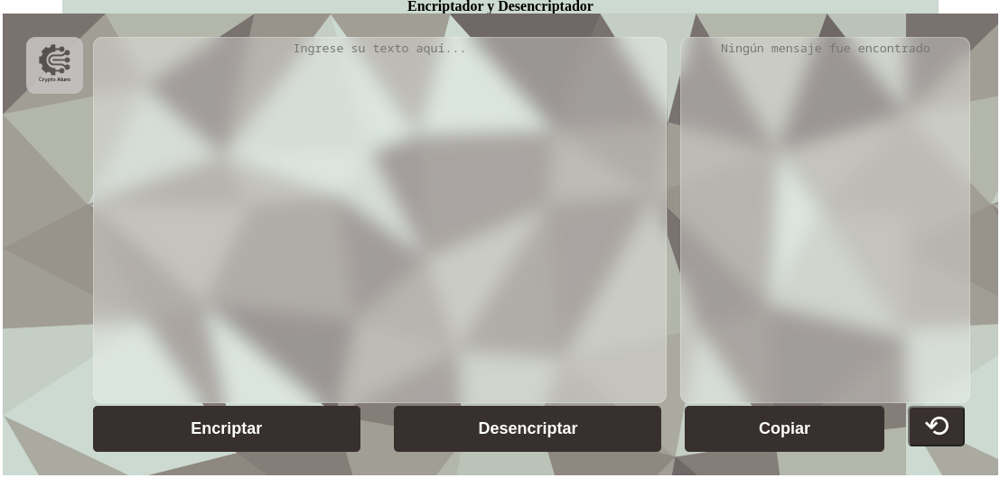
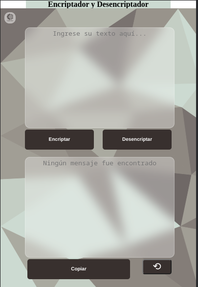

# Alura-One | Text Encryptor.

     

### Technologies used:

- [HTML 5](https://developer.mozilla.org/es/docs/Web/HTTP)
- [CSS 3](https://developer.mozilla.org/es/docs/Web/CSS)
- [JavaScript](https://developer.mozilla.org/es/docs/Web/JavaScript)
- [Visual Studio Code](https://code.visualstudio.com)

Alura Projects and Challenges.

This is a project for the first challenge in the Alura specialization. It's a web encryptor/decryptor written in HTML, CSS, and JavaScript. The encryption is done using the following rules:

- The letter "a" is converted to "ai"
- The letter "e" is converted to "enter"
- The letter "i" is converted to "imes"
- The letter "o" is converted to "ober"
- The letter "u" is converted to "ufat"

## Implementation

This project is implemented using Github Pages. To do it yourself, follow these steps:

1. Create a new repository on Github.
2. Clone the repository to your local machine.
3. Add the HTML, CSS, and JavaScript files to the repository folder.
4. Create an `index.html` file containing the necessary HTML code for your website.
5. Add a link to your JavaScript file in the `index.html` file.
6. Create a `README.md` file for your repository.
7. Add a description of the project, implementation instructions, and any other relevant information to your `README.md` file.
8. Push all the changes to the Github repository.
9. Enable Github Pages in the repository settings to publish your website.

## Usage

To use this encryptor/decryptor, follow these steps:

1. Open your web browser.
2. Navigate to the following link: [Encryptor](https://emersondivb0.github.io/Alura-One/).
3. Enter the text you want to encrypt or decrypt in the input field.
4. Select whether you want to encrypt or decrypt the text using the corresponding buttons.
5. Click the "Encrypt" or "Decrypt" button.
6. The encrypted or decrypted text will be displayed in the output field.
7. There is a button to copy the output text and a button to clear everything.

## Contribution

If you wish to contribute to this project, you can do so by following these steps:

1. Fork this repository on Github.
2. Clone the forked repository to your local machine.
3. Create a new branch for your changes.
4. Make the desired changes in the branch.
5. Submit a pull request to merge your changes into this repository.

link  Emerson González

